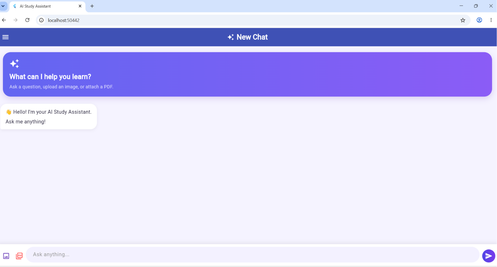
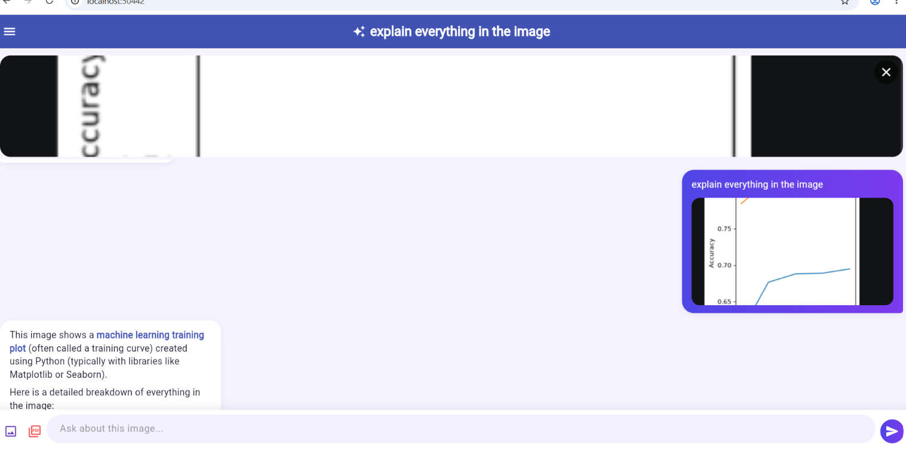
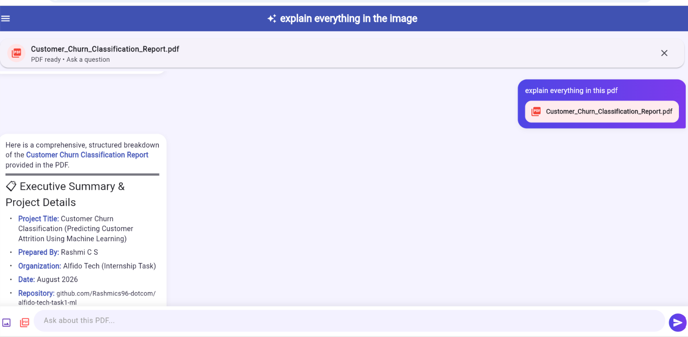
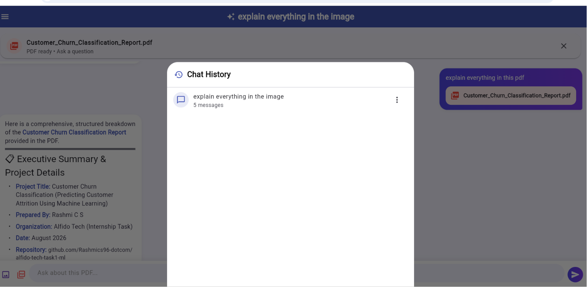
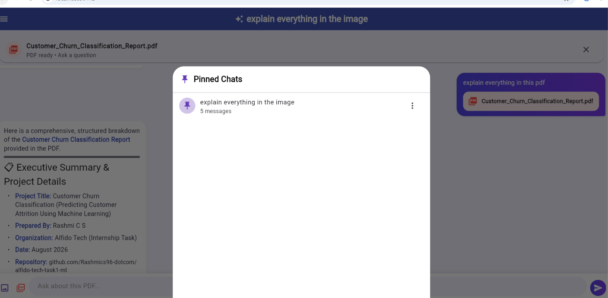

# 🤖 AI Study Assistant

An AI-powered study assistant built using Flutter and the Gemini API.

The application allows users to interact with an AI assistant, ask questions, upload images and PDFs, and continue previous conversations through persistent chat history.

## ✨ Features

- 🤖 AI-powered chat using Gemini
- 🖼️ Image upload and image-based question answering
- 📄 PDF upload and PDF question answering
- 💬 Persistent chat conversations
- 🕘 Chat history
- 📌 Pin and unpin conversations
- ✏️ Rename conversations
- 🗑️ Delete conversations
- 🆕 Create new chats
- 🔄 Continue previous conversations
- 👀 Image and PDF previews
- 📝 Markdown-formatted AI responses
- ⏳ AI thinking indicator
- 🛡️ API rate-limit and error handling
- 🎨 Colorful user interface
- 💾 Local conversation storage

## 🛠️ Technologies Used

- Flutter
- Dart
- Gemini API
- google_generative_ai
- image_picker
- file_picker
- flutter_markdown
- shared_preferences
- syncfusion_flutter_pdf

## ⚙️ Installation

Clone the repository:

```bash
git clone YOUR_GITHUB_REPOSITORY_URL

## 🔑 Gemini API Key Configuration

⚠️ **IMPORTANT:** The Gemini API key is not included in this GitHub repository for security reasons.

The application requires a Gemini API key to use the AI features.

### ▶️ IMPORTANT — Run This Command

After running `flutter pub get`, start the application using:

```bash
flutter run -d chrome --dart-define=GEMINI_API_KEY=YOUR_API_KEY
replace YOUR_API_KEY with your real API key


## 📸 Application Screenshots

### 🏠 AI Study Assistant



### 🖼️ Image Question Answering



### 📄 PDF Question Answering



### 🕘 Chat History



### 📌 Pinned Chats



👩‍💻 Author

Rashmi C S
